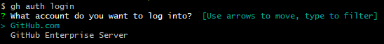
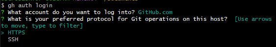
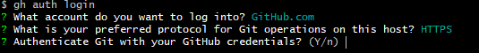
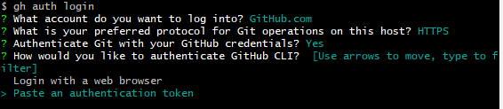
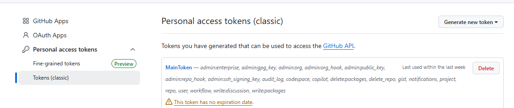
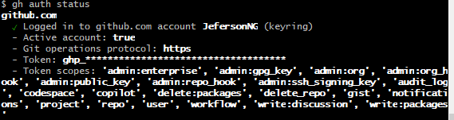
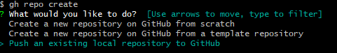

Primeiros passos para uso do git
apos baixar git usar alguns comandos para fazer loguin

gh auth login

usar HTTPS

Y para usar chave

usar chavekey

criar chave no github

Logado

criar repo apartir repo local

fazer repo local
na pasta usar
git init
git add . 
git commit -m "Created"

git push origin main

